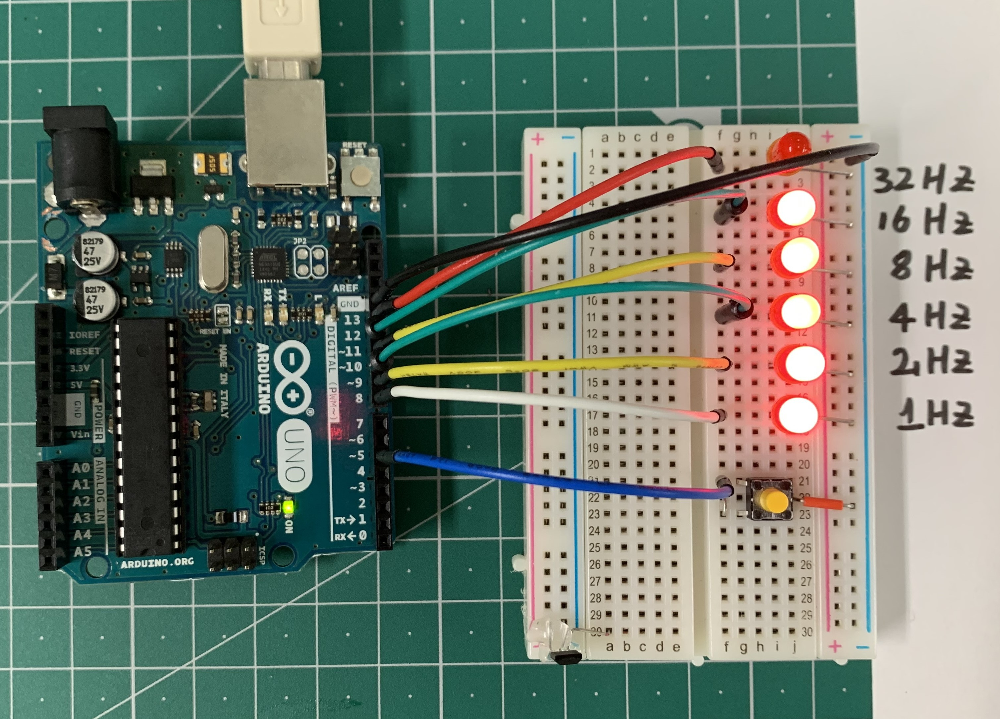

# Arduino_multi_led_control
using led class to control multi LED in different blinking frequency when the tact buttton was pressed.

**Youtube Video is Here (lv3)** 

**Youtube Video is Here (lv4)** 

